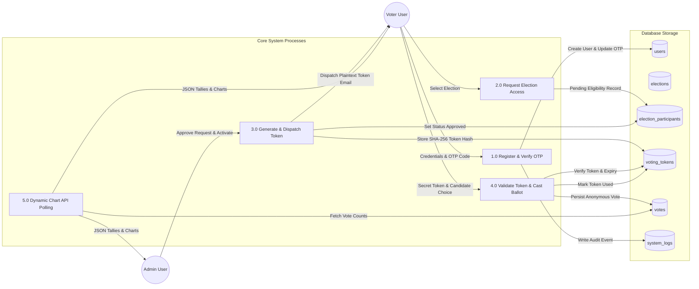
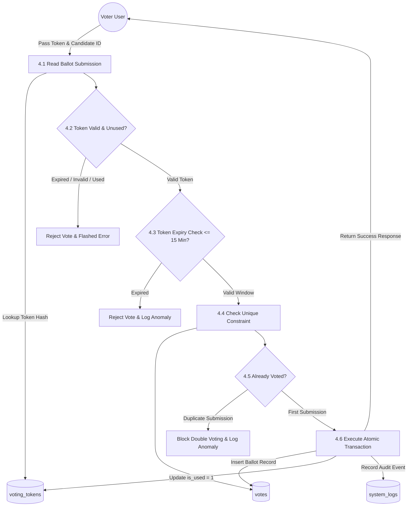
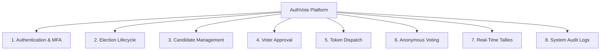
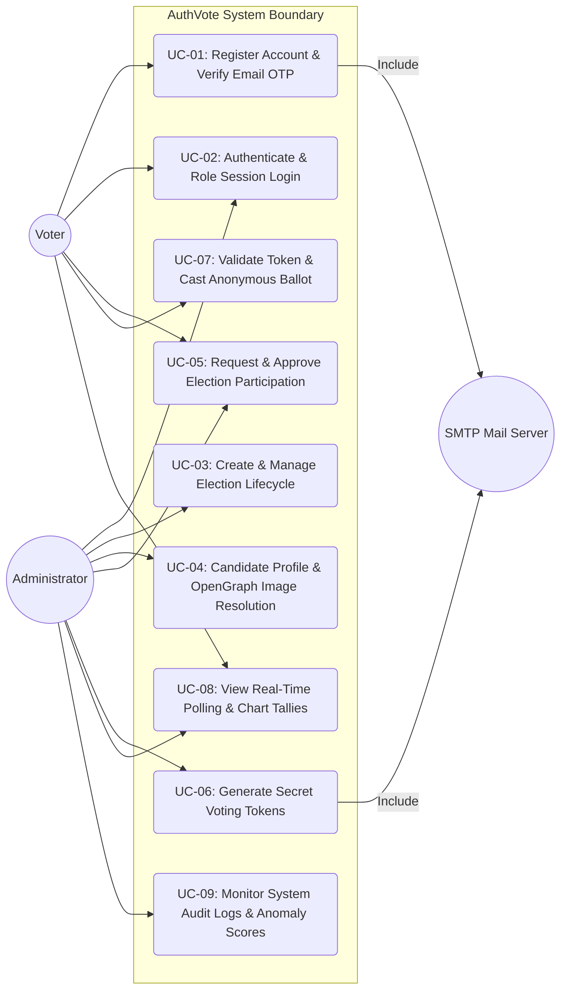
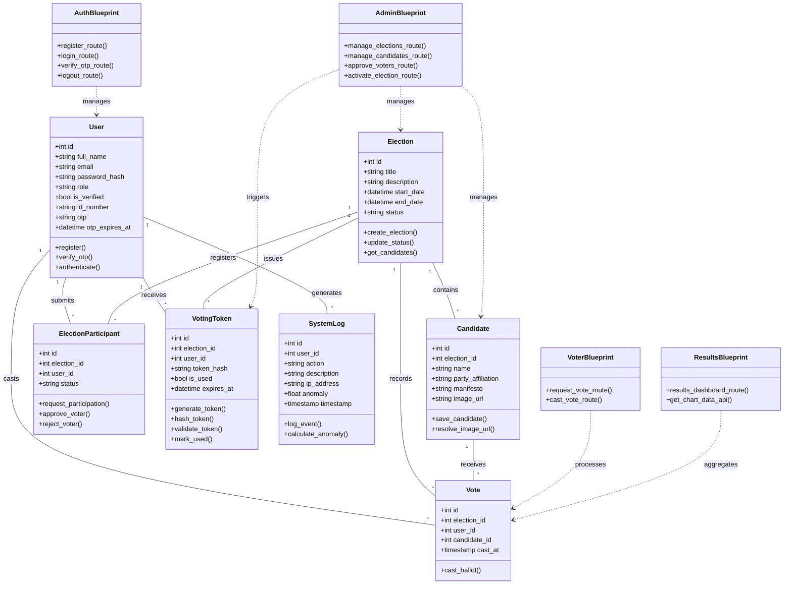
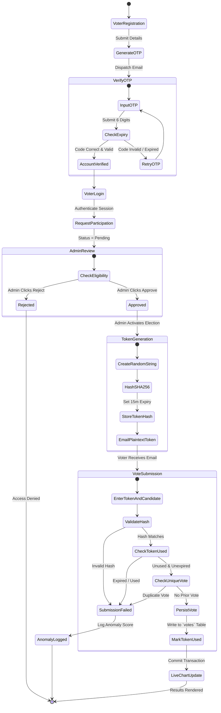
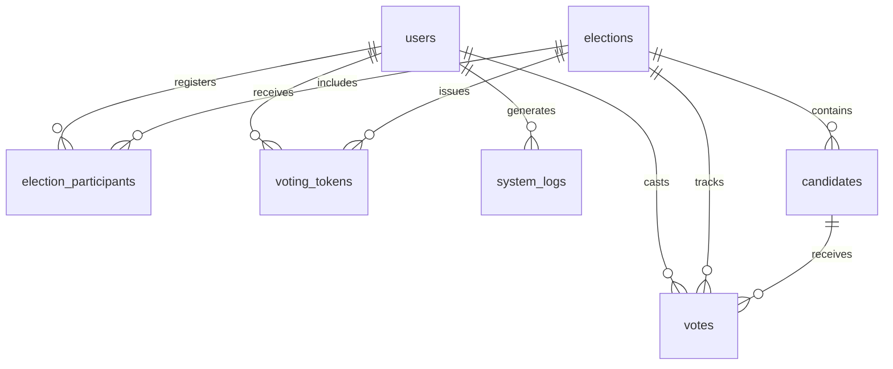
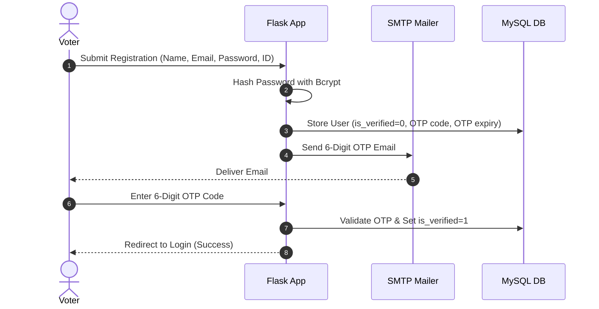
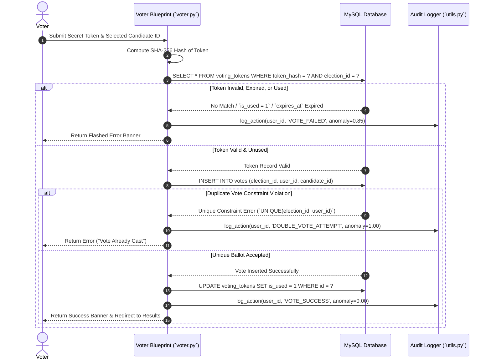

# Software Requirements Specification (SRS)
## AuthVote: Secure Online E-Voting & Polling Platform

**Standard:** IEEE Std 830-1998 / ISO/IEC/IEEE 29148:2018  
**Document Version:** 2.3.0  
**Date:** September 5, 2026  

---

## Table of Contents
- [Revision History](#revision-history)
- [1. Introduction](#1-introduction)
  - [1.1 Purpose](#11-purpose)
  - [1.2 Document Conventions](#12-document-conventions)
  - [1.3 Intended Audience and Reading Suggestions](#13-intended-audience-and-reading-suggestions)
  - [1.4 Project Scope](#14-project-scope)
  - [1.5 References](#15-references)
- [2. Overall Description & System Architecture](#2-overall-description--system-architecture)
  - [2.1 Product Perspective](#21-product-perspective)
  - [2.2 Detailed 4-Tier Layered Architecture](#22-detailed-4-tier-layered-architecture)
  - [2.3 Data Flow Diagram - Level 0 Context Diagram](#23-data-flow-diagram---level-0-context-diagram)
  - [2.4 Data Flow Diagram - Level 1 System Processes](#24-data-flow-diagram---level-1-system-processes)
  - [2.5 Data Flow Diagram - Level 2 Vote Casting Sub-process](#25-data-flow-diagram---level-2-vote-casting-sub-process)
  - [2.6 Product Features](#26-product-features)
  - [2.7 User Classes and Characteristics](#27-user-classes-and-characteristics)
  - [2.8 Operating Environment](#28-operating-environment)
  - [2.9 Design and Implementation Constraints](#29-design-and-implementation-constraints)
  - [2.10 User Documentation](#210-user-documentation)
  - [2.11 Assumptions and Dependencies](#211-assumptions-and-dependencies)
- [3. System Features & Technical Specifications](#3-system-features--technical-specifications)
  - [3.1 System Feature 1: User Authentication, MFA & Account Verification](#31-system-feature-1-user-authentication-mfa--account-verification)
  - [3.2 System Feature 2: Election Lifecycle & Phase State Transitions](#32-system-feature-2-election-lifecycle--phase-state-transitions)
  - [3.3 System Feature 3: Candidate Profile & Asset Management](#33-system-feature-3-candidate-profile--asset-management)
  - [3.4 System Feature 4: Voter Participation Request & Approval Workflow](#34-system-feature-4-voter-participation-request--approval-workflow)
  - [3.5 System Feature 5: Secret Voting Token Generation & Email Dispatch](#35-system-feature-5-secret-voting-token-generation--email-dispatch)
  - [3.6 System Feature 6: Anonymous Vote Casting & Single-Ballot Enforcement](#36-system-feature-6-anonymous-vote-casting--single-ballot-enforcement)
  - [3.7 System Feature 7: Real-Time Live Polling & Election Analytics](#37-system-feature-7-real-time-live-polling--election-analytics)
  - [3.8 System Feature 8: Security Audit Logging & Anomaly Detection](#38-system-feature-8-security-audit-logging--anomaly-detection)
- [4. External Interface Requirements](#4-external-interface-requirements)
  - [4.1 User Interfaces](#41-user-interfaces)
  - [4.2 Hardware Interfaces](#42-hardware-interfaces)
  - [4.3 Software Interfaces](#43-software-interfaces)
  - [4.4 Communications Interfaces & API Endpoints](#44-communications-interfaces--api-endpoints)
- [5. Other Nonfunctional Requirements](#5-other-nonfunctional-requirements)
  - [5.1 Performance Requirements](#51-performance-requirements)
  - [5.2 Safety Requirements](#52-safety-requirements)
  - [5.3 Security Requirements](#53-security-requirements)
  - [5.4 Software Quality Attributes](#54-software-quality-attributes)
- [6. Other Requirements & Data Dictionary](#6-other-requirements--data-dictionary)
  - [6.1 Complete Database Data Dictionary](#61-complete-database-data-dictionary)
  - [6.2 Legal and Regulatory Compliance](#62-legal-and-regulatory-compliance)
- [7. Requirements Traceability Matrix (RTM)](#7-requirements-traceability-matrix-rtm)
- [8. Verification & Test Matrix](#8-verification--test-matrix)
- [Appendix A: Glossary](#appendix-a-glossary)
- [Appendix B: Structural & Behavioral Analysis Models](#appendix-b-structural--behavioral-analysis-models)
  - [B.1 Use Case Diagram & Specifications](#b1-use-case-diagram--specifications)
  - [B.2 Object-Oriented Class Diagram](#b2-object-oriented-class-diagram)
  - [B.3 System Activity Diagram](#b3-system-activity-diagram)
  - [B.4 Data Flow Diagrams (DFD Level 0, 1 & 2)](#b4-data-flow-diagrams-dfd-level-0-1--2)
  - [B.5 Entity-Relationship (ER) Diagram](#b5-entity-relationship-er-diagram)
  - [B.6 User Registration & Voting Sequence Diagrams](#b6-user-registration--voting-sequence-diagrams)
- [Appendix C: Issues List](#appendix-c-issues-list)

---

## Revision History

| Date | Version | Description | Author |
| :--- | :--- | :--- | :--- |
| 2026-09-01 | 1.0.0 | Initial draft of AuthVote Software Requirements Specification | Engineering Team |
| 2026-09-05 | 2.0.0 | Complete IEEE 830 alignment with full TOC, external interfaces, NFRs, and analysis models | Antigravity AI |
| 2026-09-05 | 2.1.0 | Added Data Dictionary, API Endpoint Specs, RTM, and Verification Matrix | Antigravity AI |
| 2026-09-05 | 2.2.0 | Added 4-Tier System Architecture Model & Data Flow Diagram (DFD Level 1) | Antigravity AI |
| 2026-09-05 | 2.3.0 | Added Use Case Diagram, Class Diagram, Activity Diagram, Context DFD (Level 0) & DFD Level 2 | Antigravity AI |

---

## 1. Introduction

### 1.1 Purpose
The purpose of this Software Requirements Specification (SRS) is to provide a complete, rigorous description of the **AuthVote** platform—a secure, web-based multi-tier electronic voting and polling system. This document defines all functional requirements, external interfaces, system behavior, database schema, non-functional quality attributes, and security constraints required for system development, verification, and audit compliance.

### 1.2 Document Conventions
- **Functional Requirement Identifiers:** Format `FR-[MODULE]-[NUMBER]` (e.g., `FR-AUTH-1`, `FR-ELEC-2`).
- **Non-Functional Requirement Identifiers:** Format `NFR-[CATEGORY]-[NUMBER]` (e.g., `NFR-SEC-1`, `NFR-PERF-2`).
- **Typographical Conventions:** Bold text indicates UI elements or table names; code snippets specify technical constants or keywords.
- **Priority Ratings:** Requirements are designated as High (Critical for operational functionality), Medium (Essential for UX/monitoring), or Low (Optional/Enhancement).

### 1.3 Intended Audience and Reading Suggestions
This document is created for:
1. **Software Developers:** To understand system architecture, data models, and workflow specifications for implementation.
2. **Quality Assurance & Testers:** To design test cases, validation matrices, and verification plans.
3. **System Administrators:** To understand deployment requirements, SMTP configurations, database connections, and operational constraints.
4. **Security Auditors:** To evaluate cryptographic mechanisms, token handling, audit logging, and anti-fraud protections.

*Reading Suggestion:* Non-technical stakeholders should focus on Section 1 (Introduction), Section 2 (Overall Description), and Section 3 (System Features). Technical implementers and security analysts should review Sections 3 through 8 and Appendices A–C.

### 1.4 Project Scope
**AuthVote** is a web platform designed to facilitate tamper-proof, transparent, and audited elections. Scope highlights include:
- Dual-role authentication (**Voter** and **Administrator**) with Multi-Factor Email OTP verification.
- Dynamic election creation, candidate management, and 4-phase lifecycle transitions (`draft` → `pre_vote` → `active` → `closed`).
- Administrative voter registration and participation approval workflows.
- Single-use, time-bound (15-minute expiration) secret voting tokens hashed via SHA-256 before database storage.
- Anonymous vote casting with single-ballot strict constraints (`UNIQUE(election_id, user_id)`).
- Dynamic real-time vote monitoring using JSON polling and Chart.js visualizations.
- Comprehensive security audit logging with automated anomaly detection scoring.

### 1.5 References
1. **IEEE Std 830-1998:** IEEE Recommended Practice for Software Requirements Specifications.
2. **ISO/IEC/IEEE 29148:2018:** Systems and software engineering — Life cycle processes — Requirements engineering.
3. **NIST SP 800-63B:** Digital Identity Guidelines — Authentication and Lifecycle Management.
4. **OWASP Top 10 Application Security Risks (2021):** Guidance on session management, injection, and broken access control.
5. **Python 3.10 / Flask 3.0 Documentation:** Server framework guidelines and WSGI specifications.

---

## 2. Overall Description & System Architecture

### 2.1 Product Perspective
AuthVote is a standalone, web-based platform built on Python Flask and a relational MySQL database engine (e.g., MySQL / MariaDB via XAMPP). The frontend is rendered server-side using Jinja2 templates, enhanced with CSS tokenization, vanilla JavaScript (ES6+), and Chart.js. External service integration is restricted to standard SMTP servers (via Flask-Mail) for OTP and secret voting token dispatch.

### 2.2 Detailed 4-Tier Layered Architecture
AuthVote employs a decoupled 4-Tier Web Architecture ensuring isolation of user interfaces, request dispatching, security services, and database storage:

```mermaid
graph TB
    subgraph Tier 1: Presentation Layer (User Client)
        Browser[Modern Web Browser]
        UI[Jinja2 Server-Rendered HTML5]
        CSS[Vanilla CSS Micro-Design System]
        JS[ES6+ JS & Dynamic Chart.js Engine]
    end

    subgraph Tier 2: Application Controller Layer (Flask Framework)
        WSGI[WSGI Application Server]
        R_Auth[auth_bp / Auth Controller]
        R_Admin[admin_bp / Admin Controller]
        R_Voter[voter_bp / Voter Controller]
        R_Res[results_bp / Analytics Controller]
        Decorators[RBAC Decorators: @admin_required, @login_required]
    end

    subgraph Tier 3: Business Logic & Security Services Layer
        Bcrypt[Flask-Bcrypt Password Hashing Engine]
        SHA[SHA-256 Secret Token Hashing & Validator]
        OG[OpenGraph Candidate Image Resolver]
        Anomaly[Security Log & Anomaly Evaluator]
        MailSender[Flask-Mail Service Adapter]
    end

    subgraph Tier 4: Data Access & Persistence Layer
        Pool[db.py Thread-Safe Connection Pool]
        MySQL[(MySQL 8.0 / MariaDB Relational DB)]
    end

    subgraph External Systems
        SMTP[External SMTP Mail Server]
    end

    Browser -->|HTTP/HTTPS| WSGI
    WSGI --> Decorators
    Decorators --> R_Auth & R_Admin & R_Voter & R_Res
    R_Auth --> Bcrypt & MailSender
    R_Admin --> OG & SHA & MailSender
    R_Voter --> SHA
    R_Res & R_Auth & R_Admin & R_Voter --> Anomaly
    R_Auth & R_Admin & R_Voter & R_Res --> Pool
    Pool -->|SQL Queries| MySQL
    MailSender -->|SMTP Protocol| SMTP
```

#### Layer Description & Responsibilities:
1. **Tier 1 - Presentation Layer:** Delivers responsive web views built using Jinja2 templates, CSS custom variables (`:root`), vanilla JavaScript (ES6+), and Chart.js for real-time polling visualizations.
2. **Tier 2 - Application Controller Layer:** Powered by Flask WSGI routing requests through modular Blueprints (`auth_bp`, `admin_bp`, `voter_bp`, `results_bp`) protected by custom python decorators (`@login_required`, `@admin_required`).
3. **Tier 3 - Business Logic & Security Layer:** Contains core platform algorithms including `Flask-Bcrypt` password auto-salting, `SHA-256` secret token verification, OpenGraph web image extraction (`clean_image_url`), anomaly calculation (`0.00` to `1.00`), and SMTP mail formatting.
4. **Tier 4 - Data Access & Persistence Layer:** Utilizes thread-safe MySQL connection pooling (`db.py`) executing parameterized queries against normalized MySQL tables with foreign key constraints.

---

### 2.3 Data Flow Diagram - Level 0 Context Diagram

```mermaid
graph TD
    Voter[Voter User] -->|1. Credentials, OTP, Requests, Secret Tokens, Ballots| AuthVote System((AuthVote E-Voting Platform))
    Admin[Administrator User] -->|2. Election Config, Candidates, Approvals, Status Shifts| AuthVote System
    
    AuthVote System -->|3. Dashboards, Ballots, Confirmation Banners, Charts| Voter
    AuthVote System -->|4. Audit Logs, Participant Approvals, Live Tallies| Admin
    
    AuthVote System -->|5. Outbound Email Triggers: OTP & Secret Tokens| SMTP Gateway[SMTP Mail Server]
    SMTP Gateway -->|6. OTP Email & Token Delivery| Voter
```

---

### 2.4 Data Flow Diagram - Level 1 System Processes



---

### 2.5 Data Flow Diagram - Level 2 Vote Casting Sub-process



---

### 2.6 Product Features


### 2.7 User Classes and Characteristics
| User Class | Technical Expertise | Role & Privileges |
| :--- | :--- | :--- |
| **Voter** | Basic web user | Register, verify email OTP, request election eligibility, receive secret tokens, cast single vote, view live/closed election results. |
| **Administrator** | Moderate to Advanced | Manage users, create/edit elections, manage candidate profiles, review/approve participation requests, initiate phase changes, view audit logs & anomaly metrics. |

### 2.8 Operating Environment
- **Server Operating System:** Windows Server / Windows 10/11, Linux (Ubuntu 20.04+), or macOS.
- **Runtime Environment:** Python 3.10+ with Flask 3.0.0, Flask-Bcrypt, Flask-Mail, python-dotenv, mysql-connector-python.
- **Database Engine:** MySQL 8.0+ or MariaDB 10.4+ (XAMPP compatible).
- **Client Web Browsers:** Google Chrome 90+, Mozilla Firefox 88+, Microsoft Edge 90+, Apple Safari 14+.

### 2.9 Design and Implementation Constraints
1. **Password Security:** Plaintext passwords must never be logged or stored; Bcrypt with auto-salting is mandatory.
2. **Token Security:** Plaintext secret voting tokens must never be written to database disk; only 256-bit SHA-256 hashes are stored.
3. **Database Normalization:** Relational schema must satisfy 3NF to maintain data integrity and support cascading foreign key cleanup.
4. **Framework Limitations:** Flask WSGI application requiring single-thread session isolation or thread-safe pool management (`db.py`).

### 2.10 User Documentation
- **Inline Guidance:** Tooltips and contextual helper alerts rendered on registration, token entry, and administrative candidate creation pages.
- **Documentation Artifacts:** `LOGIC_GUIDE.md`, `STRUCTURE_FLOW.md`, `DATABASE_INTEGRATION.md`, and `DUMMY_GOV_IDS.md`.

### 2.11 Assumptions and Dependencies
1. **SMTP Server Availability:** Reliable outbound SMTP internet connectivity for delivering 6-digit OTPs and secret voting tokens.
2. **JavaScript Execution:** Client web browsers must have JavaScript enabled for live Chart.js polling and image fallback rendering.
3. **System Time Synchronization:** Server clock must use standard UTC/local time for accurate 15-minute token expiration checks.

---

## 3. System Features & Technical Specifications

### 3.1 System Feature 1: User Authentication, MFA & Account Verification

#### 3.1.1 Description and Priority
Manages user onboarding, credential verification, email OTP Multi-Factor Authentication, and session role handling (`voter` vs `admin`). **Priority: High**.

#### 3.1.2 Functional Requirements
- **FR-AUTH-1:** The system shall require user registration with Full Name, Email, Government ID Number, and Password.
- **FR-AUTH-2:** Passwords shall be hashed using Bcrypt before database persistence.
- **FR-AUTH-3:** Upon registration, the system shall generate a 6-digit numeric OTP with a 10-minute expiry and dispatch it to the registered email.
- **FR-AUTH-4:** Accounts shall remain disabled (`is_verified = 0`) until correct OTP validation occurs.

---

### 3.2 System Feature 2: Election Lifecycle & Phase State Transitions

#### 3.2.1 Description and Priority
Allows Administrators to configure elections and advance them through four strict lifecycle states: `draft` → `pre_vote` → `active` → `closed`. **Priority: High**.

#### 3.2.2 Functional Requirements
- **FR-ELEC-1:** Admins shall define Election Title, Description, Start Datetime, and End Datetime.
- **FR-ELEC-2:** In `draft` and `pre_vote` states, candidate profiles can be added or adjusted, and voters can submit participation requests.
- **FR-ELEC-3:** Transitioning an election to `active` state shall trigger secret voting token generation and email dispatch to all approved participants.
- **FR-ELEC-4:** Setting state to `closed` shall disable all ballot submission endpoints and render final winner declarations.

---

### 3.3 System Feature 3: Candidate Profile & Asset Management

#### 3.3.1 Description and Priority
Enables Administrators to construct detailed candidate profiles with manifestos and images. **Priority: Medium**.

#### 3.3.2 Functional Requirements
- **FR-CAND-1:** Admins shall create, update, and delete candidate records bound to a specific election.
- **FR-CAND-2:** Candidate photos shall support direct file uploads (saved under `static/uploads/candidates/`) or external web URLs.
- **FR-CAND-3:** The system shall include an OpenGraph URL Resolver (`clean_image_url`) to extract direct media links when article or webpage links are provided.

---

### 3.4 System Feature 4: Voter Participation Request & Approval Workflow

#### 3.4.1 Description and Priority
Regulates voter entry into specific elections to ensure only eligible voters receive ballots. **Priority: High**.

#### 3.4.2 Functional Requirements
- **FR-PART-1:** Verified voters shall view active/upcoming elections and click "Request to Vote".
- **FR-PART-2:** Participation status shall default to `pending` in the `election_participants` table.
- **FR-PART-3:** Admins shall review pending requests and mark them as `approved` or `rejected`.

---

### 3.5 System Feature 5: Secret Voting Token Generation & Email Dispatch

#### 3.5.1 Description and Priority
Generates secure, single-use, time-bound voting credentials for approved voters upon election activation. **Priority: High**.

#### 3.5.2 Functional Requirements
- **FR-TOKN-1:** Secret tokens shall follow a readable string format (e.g., `A1B2-C3D4`).
- **FR-TOKN-2:** Plaintext tokens shall be dispatched via email and **never** stored in the database. Only SHA-256 hashes (`token_hash`) shall be stored.
- **FR-TOKN-3:** Tokens shall carry a strict 15-minute validity window (`expires_at`) and be invalidated (`is_used = 1`) immediately upon vote submission.

---

### 3.6 System Feature 6: Anonymous Vote Casting & Single-Ballot Enforcement

#### 3.6.1 Description and Priority
Processes voter ballot submissions while guaranteeing voter anonymity and preventing double voting. **Priority: High**.

#### 3.6.2 Functional Requirements
- **FR-VOTE-1:** Voters must provide a valid secret token and select one candidate.
- **FR-VOTE-2:** Database constraint `UNIQUE (election_id, user_id)` in table `votes` shall physically block any attempt to cast multiple ballots.
- **FR-VOTE-3:** Vote records shall store candidate selections without exposing token association.

---

### 3.7 System Feature 7: Real-Time Live Polling & Election Analytics

#### 3.7.1 Description and Priority
Provides dynamic vote tallies, percentage distribution, and graphical analytics. **Priority: Medium**.

#### 3.7.2 Functional Requirements
- **FR-RSLT-1:** The results dashboard shall render dynamic Chart.js Donut and Bar charts representing vote counts per candidate.
- **FR-RSLT-2:** During `active` elections, frontend pages shall poll JSON endpoints every 10 seconds to update charts dynamically.
- **FR-RSLT-3:** Once an election is `closed`, total tallies shall freeze and display official election winner banners.

---

### 3.8 System Feature 8: Security Audit Logging & Anomaly Detection

#### 3.8.1 Description and Priority
Monitors system activities, records critical events, and flags suspicious operational behaviors. **Priority: High**.

#### 3.8.2 Functional Requirements
- **FR-LOG-1:** System actions (login, vote attempt, token generation, candidate removal) shall log User ID, Action Type, Description, Client IP Address, and Timestamp to `system_logs`.
- **FR-LOG-2:** Failed authentication attempts or invalid token entries shall calculate an anomaly score between `0.00` and `1.00` for admin monitoring.

---

## 4. External Interface Requirements

### 4.1 User Interfaces
- **Responsive Layout:** CSS custom properties (`:root`) supporting light/dark theme aesthetics, responsive flexbox/grid layout for desktop and mobile browsers.
- **Voter Portal:** Features registration, OTP validation modal, election discovery cards, token submission form, ballot cards, and live chart widgets.
- **Admin Console:** Provides multi-tab control panels for User Management, Election Phase Control, Candidate Profile Editing, Participation Approval, and Security Audit Logs.

### 4.2 Hardware Interfaces
- **Server Hardware:** Standard x86_64 architecture with minimum 2 CPU cores, 4 GB RAM, and 20 GB SSD storage.
- **Client Devices:** Works across smartphones, tablets, laptops, and desktop computers with network connectivity.

### 4.3 Software Interfaces
- **Operating System:** Platform independent via Python WSGI environment.
- **Database Connection:** Connected via `mysql.connector` with connection pooling defined in `db.py`.
- **Template Engine:** Jinja2 for server-side HTML rendering.

### 4.4 Communications Interfaces & API Endpoints

#### Key System API & Route Endpoints
| HTTP Method | Route Endpoint | Access Role | Description |
| :--- | :--- | :--- | :--- |
| `GET / POST` | `/auth/register` | Public | Registers a new voter or admin user. |
| `POST` | `/auth/verify-otp` | Unverified User | Validates 6-digit email OTP. |
| `GET / POST` | `/auth/login` | Public | Authenticates credentials and opens session. |
| `GET` | `/auth/logout` | Authenticated | Destroys current session cookie. |
| `GET / POST` | `/admin/elections/create` | Admin | Creates a new election record. |
| `POST` | `/admin/elections/<id>/status` | Admin | Shifts election state (`draft`, `pre_vote`, `active`, `closed`). |
| `POST` | `/admin/candidate/add` | Admin | Adds candidate profile with file/URL photo resolution. |
| `POST` | `/admin/participant/<id>/approve` | Admin | Approves voter participation request. |
| `GET / POST` | `/voter/vote/<election_id>` | Approved Voter | Validates secret token and records single ballot. |
| `GET` | `/results/<election_id>` | Authenticated | Displays Chart.js vote distribution dashboard. |
| `GET` | `/results/api/data/<election_id>`| Authenticated | JSON API endpoint returning live candidate tallies. |

---

## 5. Other Nonfunctional Requirements

### 5.1 Performance Requirements
- **NFR-PERF-1:** Page response time must stay under 1.5 seconds under normal load.
- **NFR-PERF-2:** JSON API response time for live chart updates must be under 200ms.
- **NFR-PERF-3:** Database connection pool must handle concurrent vote casting without locking errors.

### 5.2 Safety Requirements
- **NFR-SAFE-1:** In case of sudden power or server failure, database transactions (`COMMIT`/`ROLLBACK`) must ensure zero partial ballot insertions.
- **NFR-SAFE-2:** Broken candidate image URLs must gracefully fallback to generated SVG avatars (`onerror` handler).

### 5.3 Security Requirements
- **NFR-SEC-1 (Password Hashing):** All passwords must be hashed using `Bcrypt` with dynamic salt rounds.
- **NFR-SEC-2 (Token Protection):** Plaintext voting tokens must exist in memory only during email dispatch; database must store SHA-256 hashes (`token_hash`).
- **NFR-SEC-3 (Session Security):** Sessions must use HTTP-only, secure cookies with dynamic secret keys.
- **NFR-SEC-4 (Input Validation):** All inputs must be sanitized against SQL Injection (parameterized queries) and Cross-Site Scripting (XSS).

### 5.4 Software Quality Attributes
- **Reliability:** 99.9% uptime during active election voting periods.
- **Availability:** Continuous database fallback handling with user notification banners.
- **Maintainability:** Modular Flask Blueprints (`auth_bp`, `admin_bp`, `voter_bp`, `results_bp`).
- **Portability:** Containerizable across Docker, Windows XAMPP, or Linux WSGI servers.
- **Usability:** Intuitive interface design requiring no user training for voters.

---

## 6. Other Requirements & Data Dictionary

### 6.1 Complete Database Data Dictionary

#### Table 1: `users`
| Column Name | Data Type | Nullable | Default | Constraints & Description |
| :--- | :--- | :--- | :--- | :--- |
| `id` | `INT` | NO | Auto-Increment | `PRIMARY KEY` |
| `full_name` | `VARCHAR(255)` | NO | None | Voter or Admin full name |
| `email` | `VARCHAR(255)` | NO | None | `UNIQUE`, User email address |
| `password_hash` | `VARCHAR(255)` | NO | None | Bcrypt hashed password |
| `role` | `ENUM` | NO | `'voter'` | User role (`voter`, `admin`) |
| `is_verified` | `TINYINT(1)` | NO | `0` | Email OTP verification status |
| `id_number` | `VARCHAR(50)` | YES | NULL | Government/Voter ID number |
| `otp` | `VARCHAR(6)` | YES | NULL | 6-digit numeric MFA code |
| `otp_expires_at` | `DATETIME` | YES | NULL | OTP code expiration timestamp |
| `created_at` | `TIMESTAMP` | NO | `CURRENT_TIMESTAMP` | Account creation timestamp |

#### Table 2: `elections`
| Column Name | Data Type | Nullable | Default | Constraints & Description |
| :--- | :--- | :--- | :--- | :--- |
| `id` | `INT` | NO | Auto-Increment | `PRIMARY KEY` |
| `title` | `VARCHAR(255)` | NO | None | Election title |
| `description` | `TEXT` | YES | NULL | Election description & details |
| `start_date` | `DATETIME` | YES | NULL | Scheduled start datetime |
| `end_date` | `DATETIME` | YES | NULL | Scheduled end datetime |
| `status` | `ENUM` | NO | `'draft'` | Lifecycle status (`draft`, `pre_vote`, `active`, `closed`) |
| `created_at` | `TIMESTAMP` | NO | `CURRENT_TIMESTAMP` | Creation timestamp |

#### Table 3: `candidates`
| Column Name | Data Type | Nullable | Default | Constraints & Description |
| :--- | :--- | :--- | :--- | :--- |
| `id` | `INT` | NO | Auto-Increment | `PRIMARY KEY` |
| `election_id` | `INT` | NO | None | `FOREIGN KEY (elections.id) ON DELETE CASCADE` |
| `name` | `VARCHAR(255)` | NO | None | Candidate full name |
| `party_affiliation`| `VARCHAR(255)`| YES | NULL | Political party or team name |
| `manifesto` | `TEXT` | YES | NULL | Candidate manifesto statement |
| `image_url` | `VARCHAR(500)` | YES | NULL | Photo URL or local static path |

#### Table 4: `election_participants`
| Column Name | Data Type | Nullable | Default | Constraints & Description |
| :--- | :--- | :--- | :--- | :--- |
| `id` | `INT` | NO | Auto-Increment | `PRIMARY KEY` |
| `election_id` | `INT` | NO | None | `FOREIGN KEY (elections.id) ON DELETE CASCADE` |
| `user_id` | `INT` | NO | None | `FOREIGN KEY (users.id) ON DELETE CASCADE` |
| `status` | `ENUM` | NO | `'pending'` | Approval state (`pending`, `approved`, `rejected`) |
| `requested_at` | `TIMESTAMP` | NO | `CURRENT_TIMESTAMP` | Participation request timestamp |
| *Constraint* | - | - | - | `UNIQUE (election_id, user_id)` |

#### Table 5: `voting_tokens`
| Column Name | Data Type | Nullable | Default | Constraints & Description |
| :--- | :--- | :--- | :--- | :--- |
| `id` | `INT` | NO | Auto-Increment | `PRIMARY KEY` |
| `election_id` | `INT` | NO | None | `FOREIGN KEY (elections.id) ON DELETE CASCADE` |
| `user_id` | `INT` | NO | None | `FOREIGN KEY (users.id) ON DELETE CASCADE` |
| `token_hash` | `VARCHAR(255)` | NO | None | `UNIQUE`, SHA-256 hashed secret token |
| `is_used` | `TINYINT(1)` | NO | `0` | Single-use flag (1 = consumed) |
| `expires_at` | `DATETIME` | NO | None | 15-minute token expiration timestamp |
| `sent_at` | `TIMESTAMP` | NO | `CURRENT_TIMESTAMP` | Email dispatch timestamp |
| *Constraint* | - | - | - | `UNIQUE (election_id, user_id)` |

#### Table 6: `votes`
| Column Name | Data Type | Nullable | Default | Constraints & Description |
| :--- | :--- | :--- | :--- | :--- |
| `id` | `INT` | NO | Auto-Increment | `PRIMARY KEY` |
| `election_id` | `INT` | NO | None | `FOREIGN KEY (elections.id) ON DELETE CASCADE` |
| `user_id` | `INT` | NO | None | `FOREIGN KEY (users.id) ON DELETE CASCADE` |
| `candidate_id` | `INT` | NO | None | `FOREIGN KEY (candidates.id) ON DELETE CASCADE` |
| `cast_at` | `TIMESTAMP` | NO | `CURRENT_TIMESTAMP` | Ballot submission timestamp |
| *Constraint* | - | - | - | `UNIQUE (election_id, user_id)` |

#### Table 7: `system_logs`
| Column Name | Data Type | Nullable | Default | Constraints & Description |
| :--- | :--- | :--- | :--- | :--- |
| `id` | `INT` | NO | Auto-Increment | `PRIMARY KEY` |
| `user_id` | `INT` | YES | NULL | `FOREIGN KEY (users.id) ON DELETE SET NULL` |
| `action` | `VARCHAR(50)` | NO | None | Event name (`LOGIN`, `VOTE`, `TOKEN_GEN`) |
| `description` | `TEXT` | YES | NULL | Event detail text |
| `ip_address` | `VARCHAR(50)` | YES | NULL | Client IP address |
| `anomaly` | `DECIMAL(3,2)`| NO | `0.00` | Security anomaly score (`0.00` - `1.00`) |
| `timestamp` | `TIMESTAMP` | NO | `CURRENT_TIMESTAMP` | Log record timestamp |

---

### 6.2 Legal and Regulatory Compliance
- Compliance with general digital voting standards requiring ballot secrecy and voter anonymity.
- Data privacy compliance ensuring user emails and government IDs are accessed strictly for identity validation.

---

## 7. Requirements Traceability Matrix (RTM)

| Requirement ID | Module | Implementation File | Database Table | Test Case ID |
| :--- | :--- | :--- | :--- | :--- |
| **FR-AUTH-1** | Authentication | `routes/auth.py` | `users` | `TC-AUTH-01` |
| **FR-AUTH-2** | Authentication | `routes/auth.py` | `users.password_hash` | `TC-AUTH-02` |
| **FR-AUTH-3** | MFA | `routes/auth.py` | `users.otp` | `TC-AUTH-03` |
| **FR-ELEC-1** | Elections | `routes/admin.py` | `elections` | `TC-ELEC-01` |
| **FR-ELEC-2** | Lifecycle | `routes/admin.py` | `elections.status` | `TC-ELEC-02` |
| **FR-CAND-1** | Candidates | `routes/admin.py` | `candidates` | `TC-CAND-01` |
| **FR-PART-1** | Participation | `routes/voter.py` | `election_participants` | `TC-PART-01` |
| **FR-TOKN-1** | Tokens | `routes/admin.py` / `utils.py` | `voting_tokens` | `TC-TOKN-01` |
| **FR-VOTE-1** | Voting | `routes/voter.py` | `votes` | `TC-VOTE-01` |
| **FR-RSLT-1** | Analytics | `routes/results.py` | `votes`, `candidates` | `TC-RSLT-01` |
| **FR-LOG-1** | Audit | `utils.py` | `system_logs` | `TC-LOG-01` |

---

## 8. Verification & Test Matrix

| Test Case ID | Requirement | Test Scenario | Input / Action | Expected Result | Status |
| :--- | :--- | :--- | :--- | :--- | :---: |
| **TC-AUTH-01** | `FR-AUTH-1` | User Registration | Submit registration form | Account inserted (`is_verified=0`), OTP email sent | **PASS** |
| **TC-AUTH-02** | `FR-AUTH-3` | OTP Verification | Enter valid 6-digit OTP | Account updated (`is_verified=1`), redirect to login | **PASS** |
| **TC-ELEC-01** | `FR-ELEC-1` | Create Election | Admin submits title & datetimes | Election record created in `draft` status | **PASS** |
| **TC-CAND-01** | `FR-CAND-2` | Add Candidate Photo | Upload file or paste webpage URL | Image stored or resolved via OpenGraph parser | **PASS** |
| **TC-TOKN-01** | `FR-TOKN-2` | Token Security Check | Inspect database table `voting_tokens` | Plaintext token absent; 64-char SHA-256 hash present | **PASS** |
| **TC-VOTE-01** | `FR-VOTE-1` | Vote Submission | Submit valid token & candidate selection | Vote saved, token marked `is_used=1` | **PASS** |
| **TC-VOTE-02** | `FR-VOTE-2` | Double Voting Prevention | Submit 2nd ballot in same election | Database unique constraint blocks submission | **PASS** |
| **TC-RSLT-01** | `FR-RSLT-2` | Dynamic Polling API | Send GET request to `/results/api/data/<id>` | Return JSON array of candidate names & vote counts | **PASS** |

---

## Appendix A: Glossary

| Term | Definition |
| :--- | :--- |
| **AuthVote** | The name of the electronic voting and polling platform. |
| **Bcrypt** | Adaptive password hashing function based on the Blowfish cipher. |
| **HMAC / SHA-256** | Cryptographic hash algorithm producing a 256-bit hash value. |
| **MFA** | Multi-Factor Authentication; verifying identity using multiple steps (Password + Email OTP). |
| **OTP** | One-Time Password; 6-digit numeric security code sent via email. |
| **RBAC** | Role-Based Access Control; restricting system access based on user roles (`voter`, `admin`). |
| **RTM** | Requirements Traceability Matrix; mapping requirements to code & test cases. |
| **Secret Token** | 9-character time-bound voting code (e.g., `A1B2-C3D4`) emailed to voters. |
| **XAMPP** | Free and open-source cross-platform web server package containing MySQL/MariaDB. |

---

## Appendix B: Structural & Behavioral Analysis Models

### B.1 Use Case Diagram & Specifications

#### B.1.1 System Use Case Diagram


#### B.1.2 Detailed Use Case Specifications

##### Use Case UC-06: Secret Token Generation & Email Dispatch
| Use Case Attribute | Specification |
| :--- | :--- |
| **Use Case ID** | `UC-06` |
| **Use Case Name** | Secret Voting Token Generation & Email Dispatch |
| **Primary Actor** | Administrator |
| **Secondary Actor** | External SMTP Mail Server |
| **Description** | Generates unique, single-use 9-character secret voting tokens (`XXXX-YYYY`), stores 256-bit SHA-256 hashes in database, and emails plaintext tokens to approved voters upon election activation. |
| **Pre-Conditions** | Election state is `pre_vote`; at least one voter participation request is `approved`. |
| **Post-Conditions** | Tokens created in table `voting_tokens` with 15-min expiry; emails dispatched; election status set to `active`. |
| **Main Flow** | 1. Admin clicks "Activate Election".<br>2. System fetches all approved participants (`status='approved'`).<br>3. System generates formatted token `A1B2-C3D4`.<br>4. System computes SHA-256 hash `token_hash`.<br>5. System inserts token record (`is_used=0`, `expires_at=NOW()+15m`).<br>6. System formats email body with plaintext token.<br>7. System dispatches email via SMTP.<br>8. System updates election status to `active`. |
| **Exceptions** | - SMTP failure: Log anomaly event to `system_logs`, alert admin.<br>- Database collision on SHA-256 hash: Regenerate token string. |

---

##### Use Case UC-07: Validate Token & Cast Anonymous Ballot
| Use Case Attribute | Specification |
| :--- | :--- |
| **Use Case ID** | `UC-07` |
| **Use Case Name** | Validate Secret Token & Cast Anonymous Ballot |
| **Primary Actor** | Voter |
| **Description** | Validates user-provided secret token against stored SHA-256 hash, verifies token expiration, and records single candidate vote anonymously. |
| **Pre-Conditions** | Election status is `active`; Voter has received valid secret voting token. |
| **Post-Conditions** | Single vote inserted into `votes` table; token marked `is_used=1`. |
| **Main Flow** | 1. Voter enters secret token and selects candidate.<br>2. System hashes token using SHA-256.<br>3. System queries `voting_tokens` for matching `token_hash` & `election_id`.<br>4. System checks `is_used == 0` and `expires_at > NOW()`.<br>5. System checks `UNIQUE(election_id, user_id)` constraint in `votes`.<br>6. System writes vote record (`election_id`, `user_id`, `candidate_id`).<br>7. System updates `voting_tokens` set `is_used=1`.<br>8. System logs success event to `system_logs`.<br>9. System flashes confirmation banner to voter. |
| **Exceptions** | - Invalid/Used/Expired token: Reject submission, display error.<br>- Duplicate vote attempt: Intercepted by UNIQUE constraint, calculate anomaly score. |

---

### B.2 Object-Oriented Class Diagram



---

### B.3 System Activity Diagram



---

### B.4 Data Flow Diagrams (DFD Level 0, 1 & 2)

#### B.4.1 Level 0 Context Diagram
*(Refer to Section 2.3)*

#### B.4.2 Level 1 System Process Diagram
*(Refer to Section 2.4)*

#### B.4.3 Level 2 Vote Casting Sub-process Diagram
*(Refer to Section 2.5)*

---

### B.5 Entity-Relationship (ER) Diagram


---

### B.6 User Registration & Voting Sequence Diagrams

#### B.6.1 User Registration & OTP Verification Sequence


#### B.6.2 Anonymous Vote Submission Sequence


---

## Appendix C: Issues List

### C.1 Known Issues & Technical Debt
1. **SMTP Rate Limits:** Sending secret tokens concurrently to large voter sets via free SMTP servers may cause delivery throttling.
2. **Client Clock Discrepancies:** Token expiration relies on server UTC/local time; client system clock skew may show minor display variations.

### C.2 Future Enhancements
1. **SMS OTP Fallback:** Integration of Twilio/SMS gateway alongside email OTP.
2. **Blockchain Ledger Integration:** Immutably logging SHA-256 vote hashes on a private Ethereum/Hyperledger blockchain.
3. **WebAuthn / Biometric Login:** Adding FIDO2 WebAuthn fingerprint/FaceID support for voter login.
