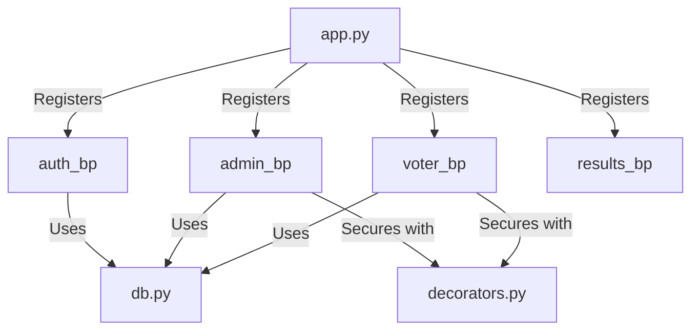

# AuthVote Code Structure & Application Flow

This document provides a high-level overview of the AuthVote platform's source code organization and data flows, designed for developers and stakeholders to understand how the system components interact.

## 1. Directory Structure

```text
trialapp/
├── app.py                # Main entry point (Flask configuration & initialization)
├── db.py                 # Database connection pooling & utility
├── utils.py              # Shared cryptographic & logging utility functions
├── decorators.py         # Custom middleware (Access Control)
├── schema.sql            # Database architecture (Table structures & relationships)
├── routes/               # Modular Backend Blueprints
│   ├── auth.py           # Registration, Login, Logout
│   ├── admin.py          # Election management, Approvals, Live Monitor
│   ├── voter.py          # Dashboard, Join requests, Voting
│   └── results.py        # Public/Private result visualizations
├── static/               # Frontend Assets (CSS, JS, Images)
└── templates/            # HTML Views (Jinja2 Templates)
    ├── admin/            # Administrative dashboard templates
    └── voter/            # Voter-specific portal templates
```

---

## 2. The Application Lifecycle

AuthVote is organized using **Flask Blueprints**, which separates concerns into logical modules. Each module contains specific routes that handle distinct user interactions.

### Component Interaction Diagram


---

## 3. Core Workflow: The Voting Process

To ensure absolute security, the flow of a single vote involves multiple handshakes between the database and the cryptographic utilities.

### Sequence Flow
1. **Join Phase**: A voter clicks "Join" (`voter.py`). The voter is automatically `approved` and their record is updated in `election_participants`.
2. **Token Generation Phase**: The system instantly triggers `generate_voting_token` (in `utils.py`) if the election is active, securely attaching an `expires_at` timestamp exacted to +15 minutes.
3. **Execution Phase (Voter)**:
    - Voter enters their raw token on the voting page (`voter.py`).
    - The system hashes the input with `hash_token`.
    - It compares the input hash against the `token_hash` in the `voting_tokens` table and explicitly checks `expires_at > NOW()`.
4. **Finalization Phase**: If valid, the vote is inserted into the `votes` table, and the token is marked as `is_used` to prevent replay attacks. The voter is safely redirected to the dashboard (results hidden).
5. **Recovery (If Expired)**: The user clicks the self-service 'Resend' route internally looping Step 2 without needing an administrator's interaction.

---

## 4. Key Security Mechanisms

### Access Control Layers
- **@login_required**: Verifies the session exists for every protected page.
- **@admin_required**: Verifies the `role` in the database is set to 'admin'.
- **CSRF Protection**: All POST forms include safe token handling.

### Forensic Trail
Every step of the flow is logged via `log_event`. This creates a persistent trail in the `system_logs` table, recording the timestamp, user ID, specific action, and any associated anomaly scores.
